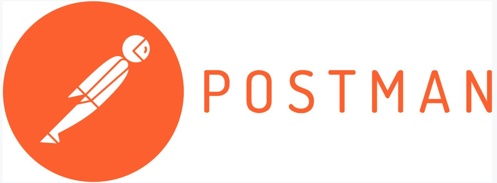

# All-Things-Postman

  

**Update:** 

It's been very difficult for me to keep this repo up to date, with the current version. Since creating this repo my professional life has changed _a lot_ - I'm now working full time for Postman and my efforts have all been about learning a new role and contributing to the whole Postman project, in a number of other different ways.

That change has had a huge impact on what I wanted to initially achieve with this repo, I'm still going to chip away at it and try and keep things up to date but as new UI changes and new functionality is being added all the time, it kinda gets away from me.

I still believe that the examples and the approaches within them are still valuable to Postman users but the media content is getting slightly dated and _might_ look slightly different from the current UI. Once I'm in a good place, time wise, I will be updating this repo with more examples.

There is a great new _Intro to Postman_ series on Postman's YouTube Channel created by [Valentin Despa](https://www.youtube.com/channel/UCUUl_HXJjU--iYjUkIgEcTw) which is well worth checking out of you're just getting started with Postman - https://www.youtube.com/playlist?list=PLM-7VG-sgbtAgGq_pef5y_ruIUBPpUgNJ

If there is anything that you would like help with or need some more information about, I would recommend dropping a message onto our [community site](https://community.getpostman.com). It's growing all the time and it currently has some very valuable information within multiple Postman specific topics.

Thank you for all the support so far, means a lot to me! :)

---

## Why create this repository?

I've been using [Postman](https://getpostman.com) for a while now and I'm still uncovering features that I didn't even know existed - There are a number of How-To guides out there explaining how to use the tool's feature set but as the platform is constantly evolving these can become out of date, really quickly.

My goal is to create a space where I can show examples of some of the many features in the tool and for it to also be a living piece of documentation, that will change over time to reflect the new changes being released.

You can keep up to date with these changes via the [Release Notes](https://www.getpostman.com/downloads/release-notes) and by subscribing to the Postman [Blog](http://blog.getpostman.com/). As well as these, there is also have a [Better Practices](https://medium.com/better-practices) Medium site full of really cool Postman usecases.

One of the main reasons why I'm a huge advocate of the tool, is the supporting [documentation and learning guides](https://www.getpostman.com/docs/) that have been created - Although I will be covering some of the same features, I will be including usable content that you can import into your own instance and work through the example at a pace that suits you.

---

Before I start explaining the many different amazing and wonderful features of Postman, I just wanted to share a few links to some alternative REST clients - Just to prove that I'm not 100% bias towards Postman :)

## [Insomnia](https://insomnia.rest/)
A similar tool to Postman and packed full of cool features. The ability to filter the response data is awesome! [Alan Richardson](https://twitter.com/eviltester) Created a great video explaining some of the features of the tool [3 Reasons to use Insomnia REST Client in your Exploratory API Testing](https://youtu.be/ErDCN_oU9a8).

## [REST Client](https://marketplace.visualstudio.com/items?itemName=humao.rest-client)
[VSCode](https://code.visualstudio.com/) extension giving you the ability to make API requests from inside the editor. Really cool!

## [Paw](https://paw.cloud/)
Paw is a full-featured HTTP client that lets you test and describe the APIs you build or consume. It has a beautiful native macOS interface to compose requests, inspect server responses, generate client code and export API definitions.

## [Restlet](https://restlet.com/modules/client/)
Restlet Client is the most popular REST client available as a Chrome extension. It automatically updates itself, can be opened in one or several browser tabs and comes with a convenient browser toolbar icon.

These are all excellent REST clients and well worth checking out - Ultimately, It's all down to personal preference and It's completely up to you, to find what meets your own requirements, in your given context.

---

## Let's get started!

I've made a huge assumption that if you're reading this you will probably have Postman downloaded and installed on your machine already - If you don't that is not a problem, just head over to the [Postman](https://www.getpostman.com/downloads/) site and grab the flavour that suits your OS. Once you're done - Be sure to come back again. :)

The tool on it's own is quite useless, in order for us to start having some fun and making requests, we need an API with some endpoints that will return some data - This is where a wonderful resource provided by [Mark Winteringham](https://twitter.com/2bittester) comes in handy! Mark has created [Restful-Booker](https://restful-booker.herokuapp.com/), a safe place for people to learn more about API testing and a active platform to try out tools like Postman or any of the other REST clients mentioned.

> "Restful-booker is a Create Read Update Delete (CRUD) Web API that comes with authentication features and loaded with a bunch of bugs for you to explore"

I would recommend taking a look through the API [documentation](https://restful-booker.herokuapp.com/apidoc/index.html) to get a feel for the type of requests we will be making within the example guides. We'll get very familiar using the GET, POST, PUT and DELETE verbs and pairing these with the powerful features of Postman.

All the requests that we will be making, will be included in a `collection` file, that can be imported directly into your local Postman application. It will start quite basic but we will be building these collections and incorporating features such as:

- Collection, Environment and Global Variables
- Preset Headers (Saving you a bunch of time)
- Pre-Request Scripts (Writing basic JavaScript to create new data with each request and other cool things)
- Tests ([Chai](http://chaijs.com/api/) style assertions)
- In-Built Test Runner
- Newman command line collection runner
- Postman Console
- Using some built in modules like `moment` and `Lodash`
- Data Driven Tests
- Forking and Merging Collections
- Workspaces
- Monitoring
- Creating Mocks
- And many more...

The format will take the form of a series of individual pages where I will explain in a bit more detail what I'm actually doing in Postman when making the requests and this will be backed up by images, gifs, code snippets etc. to try and make the information come to life. I'm a Tester so you can expect me to make observations along the way and I will be noting these down but the main focus of the examples we always be, using Postman and it's features to request data from the Restful-Booker API.

It will be an ever evolving space so if you would like me to add details covering certain features or to expand the examples in the repository - Please give me a shout [@dannydainton](https://twitter.com/DannyDainton) I'm always available to chat!

---

## Example Guides

All requests in the examples will be made to the Restful-Booker API - You can find the available endpoints [here](https://restful-booker.herokuapp.com/apidoc/index.html).

### **Current Postman version being used:** _6.3.0 Windows x64_ - [Release Notes](https://www.getpostman.com/apps#changelog)

- I'm currently using version 7 on the MacOS but the images and gifs were created with the version and OS listed above so I won't change this until I fully update the repo.

### 01 `GET` /ping

In this example we will send a request using the `/ping` route to ensure that the API is active and able to receive requests.

- [Ping the API](https://github.com/DannyDainton/All-Things-Postman/blob/master/Examples/01_pingTheAPI.md)

### 02 Create an Environment file

In this example we will be creating an Environment file and using data from this file within our requests.

- [Create environment file](https://github.com/DannyDainton/All-Things-Postman/blob/master/Examples/02_createEnvironmentFile.md)

### 03 `GET` /booking

For this example we will be making requests to the `/booking` route and using some different parameters in the requests to filter the response data.

- [Get all bookings](https://github.com/DannyDainton/All-Things-Postman/blob/master/Examples/03_getAllBookings.md)

### 04 Preset Headers

For this example we will be looking at the Preset Headers feature.

- [Pre Set Headers](https://github.com/DannyDainton/All-Things-Postman/blob/master/Examples/04_preSetHeaders.md)

### 05 Importing Files

In this example we will look at some of the methods of importing various different files into Postman.

- [Importing Files](https://github.com/DannyDainton/All-Things-Postman/blob/master/Examples/05_importingFiles.md)

### 06 `GET` /booking/{id}

In this example we will be getting the data for a single booking from the API. We will explore the endpoint using `Request Headers` and also taking a basic look at the `Pre-request Scripts` feature to make our request a little bit more dynamic.

- [Get a single booking](https://github.com/DannyDainton/All-Things-Postman/blob/master/Examples/06_getSingleBooking.md)

### 07 Creating our first test

In this example we will be taking our first look at the `Tests` feature. We will create a basic test to assert against some response data returned from the Restful-Booker API.

- [Creating our first test](https://github.com/DannyDainton/All-Things-Postman/blob/master/Examples/07_creatingOurFirstTest.md)

### 08 Extending our tests

For this example we will be taking the knowledge gained from creating our first basic test and extending this to cover more of the response data.

- [Extending our tests](https://github.com/DannyDainton/All-Things-Postman/blob/master/Examples/08_extendingOurTests.md)

### 09 Global and Dynamic variables

In this example we'll be looking at how to Create, Use and Clear Global variables. We will also be taking a look at the Dynamic Variables that Postman offers.

- [Global and Dynamic variables](https://github.com/DannyDainton/All-Things-Postman/blob/master/Examples/09_globalAndDynamicVariables.md)

### 10 `POST` /booking

In this example we'll be using the `POST` method to send data to the `/booking` endpoint and create some new bookings based on the information we provide in the request.

- [Create new bookings](https://github.com/DannyDainton/All-Things-Postman/blob/master/Examples/10_createNewBookings.md)

### 11 Dynamically create new bookings

For this example we will be using Postman to dynamically generate data using some of the built-in modules to create new bookings.

- [Dynamically create new bookings](https://github.com/DannyDainton/All-Things-Postman/blob/master/Examples/11_dynamicallyCreateNewBookings.md)

### 12 Introduction to the Collection Runner

In this example we will be looking a bit closer at the `Collection Runner` which allows us to run a series of requests.

- [Introduction to the Collection Runner](https://github.com/DannyDainton/All-Things-Postman/blob/master/Examples/12_introductionToTheCollectionRunner.md)

---
### More examples to follow shortly...

As well as this repository, I have also continued to blog about some additional Postman features:
- [Hold on, wait a moment...](https://dannydainton.com/2018/05/21/hold-on-wait-a-moment/)
- [Dynamically unset Postman Environment Variables](https://dannydainton.com/2018/06/28/dynamically-unset-postman-environment-variables/)
- [Postman and Lodash - The perfect partnership](https://dannydainton.com/2018/09/01/postman-and-lodash-the-perfect-partnership/)
- [Postman - The Bearer of good news](https://dannydainton.com/2018/09/10/postman-the-bearer-of-good-news/)
- [Using Newman to run a collection of requests through TravisCI](https://github.com/DannyDainton/postman-travisci-example)
- [Running Postman Collections with Docker and creating custom HTML reports](https://github.com/DannyDainton/postman-docker)
- [A basic node express app for running Postman Collection from a Slack Channel](https://github.com/DannyDainton/basic-newman-slack-bot)
- [A new HTML reporter for Newman offering a few extra features on top of the standard one](https://github.com/DannyDainton/newman-reporter-htmlextra)
- [An intro into how you can start creating your own custom HTML reports](https://dannydainton.com/2019/02/10/dont-let-go-of-the-handlebars/)

I'm always available to chat over on Twitter [@dannydainton](https://twitter.com/DannyDainton) and I've started answering questions on Stackoverflow under the [postman](https://stackoverflow.com/questions/tagged/postman) tag, so if you do have a specific problem, just jump over to there and I'll try my best to help :)
